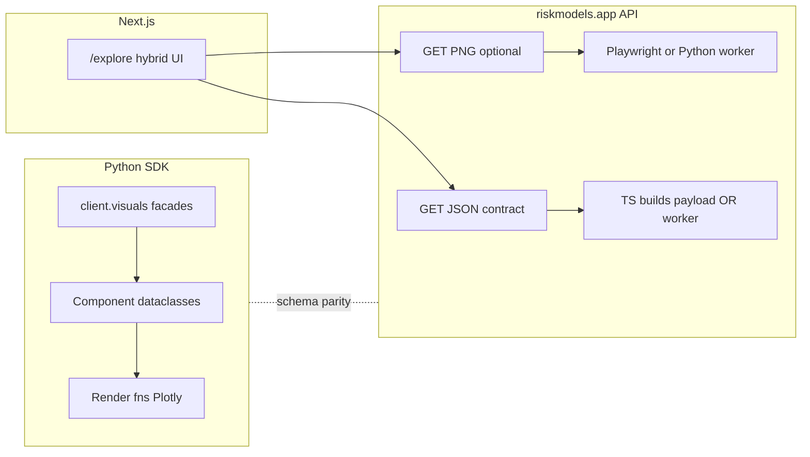

# Visual component library and /explore drill-down

Roadmap for a shared chart component layer (Python SDK + riskmodels.app API + hybrid `/explore` pages).  
Maintainers: keep this file in sync when phases ship; it mirrors the Cursor plan `visual_component_library_18810bd5`.

## Implementation checklist

- [ ] **Phase 1 — base:** Add `visuals/_base.py` + `visuals/components/`; define `schema_version` + shared `RenderOptions`.
- [ ] **Phase 1 — waterfall:** Extract `VarianceWaterfallData` + builder from `waterfall.py`; keep `plot_variance_waterfall` as adapter or `from_data` entrypoint.
- [ ] **Phase 1 — cascade:** Extract `RiskCascadeData` (and attribution variant if separate) + builders from `cascade.py`.
- [ ] **Phase 1 — tests:** JSON round-trip + Plotly smoke tests for new component dataclasses.
- [ ] **Phase 2 — schema:** Document visuals JSON schema (OpenAPI or JSON Schema); add `lib/visuals/*` TS builders matching Python.
- [ ] **Phase 2 — routes:** `GET /api/visuals/waterfall` and hedge-cascade (JSON first; `png` query optional).
- [ ] **Phase 3 — client:** Extend `ClientVisuals` with data-fetch helpers returning component dataclasses.
- [ ] **Phase 4 — explore:** `/explore` pages (B hybrid): PNG hero by default + optional “Open interactive” Plotly from same JSON + copy snippets.

## Locked decisions

- **Explore / drill-down UX (choice B):** **Hybrid** — default to a **large static PNG** (high-res, fast, consistent with PDFs); add an **optional “Open interactive”** control that reveals **full Plotly** using the **same JSON** as `/api/visuals/*`. No separate business-logic path for the interactive chart.

## Context (what already exists)

- **[`sdk/riskmodels/visuals/`](../sdk/riskmodels/visuals/)** already centralizes several Plotly builders: [`waterfall.py`](../sdk/riskmodels/visuals/waterfall.py) (`plot_variance_waterfall`), [`cascade.py`](../sdk/riskmodels/visuals/cascade.py) (`plot_risk_cascade`, `plot_attribution_cascade`), [`l3_decomposition.py`](../sdk/riskmodels/visuals/l3_decomposition.py), MAG7 helpers, [`gallery.py`](../sdk/riskmodels/visuals/gallery.py), and a thin [`client_bridge.py`](../sdk/riskmodels/visuals/client_bridge.py) (`ClientVisuals` — mostly `save_*_png` facades).
- **Snapshots** ([`R1Data`](../sdk/riskmodels/snapshots/r1_risk_profile.py), [`P1Data`](../sdk/riskmodels/snapshots/p1_stock_performance.py), [`DDData`](../sdk/riskmodels/snapshots/stock_deep_dive.py)) are page-level dataclasses; chart logic is mixed into snapshot/render modules and [`snapshots/_plotly_charts.py`](../sdk/riskmodels/snapshots/_plotly_charts.py).
- **`alpha_forensic.py`** is not in this repo; the forensic reference is called out in [`snapshots/_base_template.py`](../sdk/riskmodels/snapshots/_base_template.py) / style comments — Phase 1 should mine **this repo’s** snapshot + `visuals/` code, not an external path.
- **Portal constraint:** [`app/api/metrics/[ticker]/snapshot.png/route.ts`](../app/api/metrics/[ticker]/snapshot.png/route.ts) uses **TypeScript + Playwright** for PNG when enabled — not inline Python on the request path. Any plan that says “each API route calls the Python SDK” needs a **deployment story** (see Phase 2).

## Target shape (aligned with sketch, grounded in repo)

- Add **`sdk/riskmodels/visuals/components/`** for **small, chart-only dataclasses** + **serialization** (`to_dict` / `from_dict` or shared schema version field), not a second copy of every plot function on day one.
- Add **`sdk/riskmodels/visuals/_base.py`** (or `component_base.py`) for shared types: e.g. `RenderOptions`, `VisualSchemaVersion`, optional `lineage`/`teo` blobs — keep it minimal until patterns repeat.
- **Keep** `R1Data` / `P1Data` / `DDData`: they **compose** component payloads (either embed dataclasses or build them inside `get_data_for_*`).

## Phase 1 (low disruption) — extract first components from existing visuals

**Priority pair (already implemented as functions):**

1. **Variance waterfall (portfolio)** — today: `plot_variance_waterfall` takes `per_ticker`, `weights`, etc. Introduce e.g. `VarianceWaterfallData` holding the **minimal derived series** (labels, segment values, measure types, optional sigma mode flag) + a function `build_variance_waterfall_data(...)` from `PortfolioAnalysis` inputs, then `plot_variance_waterfall_from_data(data)` (thin wrapper) to avoid breaking gallery/tests.
2. **Risk / attribution cascade** — same pattern in `cascade.py`: `RiskCascadeData` / builders + `plot_*_from_data`.

**Follow-ons (still Phase 1 if time):**

- **Single-ticker L3 horizontal** from `l3_decomposition.py` → `L3DecompositionData`.
- **Mekko / MAG8:** no `mag8_mekko.py` yet — treat as **new** component after the first two are stable; reuse naming from portfolio math / future R3 spec.

**Tests:** add round-trip tests `Data → dict → Data` and a smoke test that `plot_*_from_data` returns a non-empty Plotly figure for a tiny synthetic frame.

## Phase 2 — `/api/visuals/*` on riskmodels.app

**Reality check:** Vercel route handlers won’t reliably `import riskmodels` unless you add a **Python render service**, subprocess, or remote worker. Recommended approach:

- **JSON responses:** implement **TypeScript builders** in `lib/visuals/` that use existing DAL ([`lib/dal/risk-engine-v3.ts`](../lib/dal/risk-engine-v3.ts), [`lib/portfolio/portfolio-risk-core.ts`](../lib/portfolio/portfolio-risk-core.ts)) and emit payloads that match the **Python dataclass JSON schema** (document the schema in [`OPENAPI_SPEC.yaml`](../OPENAPI_SPEC.yaml) or a small `schemas/visuals/*.json`).
- **PNG/PDF:** reuse patterns from `snapshot.png` / PDF routes: Playwright or existing PDF pipeline; optionally add a **CI or worker** that runs Python for pixel-perfect parity with SDK.

**First routes (examples):**

- `GET /api/visuals/waterfall` — query: `positions` JSON or portfolio id (if you have one); returns `VarianceWaterfallData` JSON.
- `GET /api/visuals/hedge-cascade` — same; `level=l2|l3` query param.

Optional `?format=png` can proxy to the same PNG machinery as snapshots once a React “chart page” template exists.

## Phase 3 — SDK `client.visuals` bridge

Extend `ClientVisuals` beyond PNG savers, e.g.:

- `client.visuals.variance_waterfall_data(positions)` → fetch metrics/batch → `PortfolioAnalysis` → `VarianceWaterfallData`.
- `client.visuals.risk_cascade_data(...)` — same.

Keep **lazy imports** to avoid heavy deps on import. `.plot()` can be methods on the dataclass (optional) or module-level `plot(data)` to stay testable.

## Phase 4 — `/explore` drill-down (**B — hybrid**, locked above)

- **Default view:** large **static PNG** (fast, consistent with PDFs), generated via the same route/worker as other snapshots.
- **Secondary control:** “Open interactive” expands a **Plotly** panel fed by the **same JSON** contract as `/api/visuals/*` (no duplicate business logic in the page — only presentation).
- Page chrome: collapsible JSON viewer, curl + Python snippet (reuse patterns from docs portal if any), export buttons calling `?format=png` / PDF when available.

**Routing sketch:** `/explore/ticker/[ticker]/waterfall`, `/explore/ticker/[ticker]/hedge-cascade` (names TBD); `/explore` index lists teaser cards linking to these.

## Out of scope for “this week” unless explicitly pulled in

- Full MAG8 Mekko + R3 portfolio ID flow.
- Rewriting all snapshot renderers to components in one pass — migrate **incrementally** after waterfall + cascade prove the pattern.

## Documentation (follow-up)

- Update [`SNAPSHOT_FRONTEND_ARCH.md`](SNAPSHOT_FRONTEND_ARCH.md) (or a short `VISUAL_COMPONENTS.md`) with: dataclass list, JSON schema version, and TS/Python parity rules.
