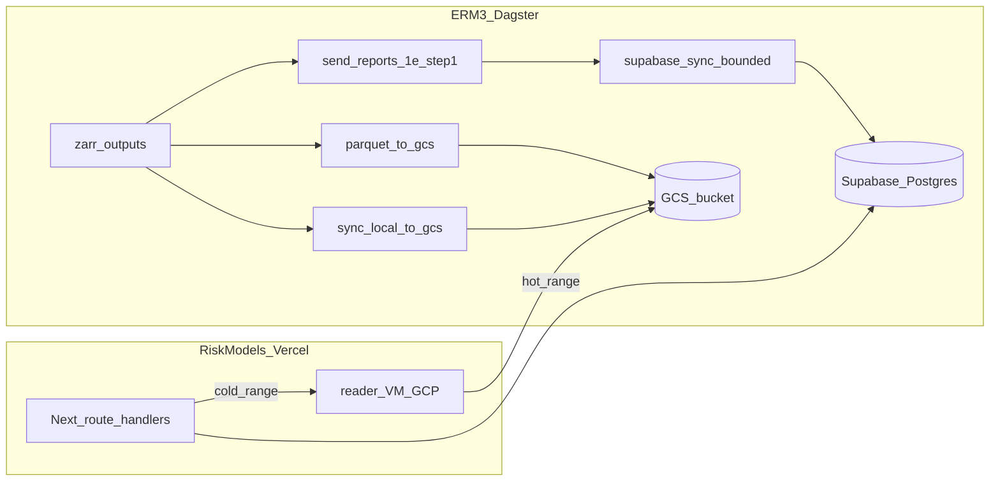

# GCS Parquet, reader VM, Dagster, API, and Supabase retention

**Overview:** Add Parquet exports to the existing GCS SSOT, a small GCP reader VM behind Vercel, Dagster pipeline hooks for full and incremental Parquet builds, API routing for hot Supabase vs cold GCS, and a bounded Supabase `security_history` retention with a safe cutover.

## Workstream checklist

- [ ] Define GCS Parquet prefix, partition scheme (monthly), schema, and v1/staging swap for full rebuilds
- [ ] Add ERM3 `scripts/python` export module reusing `supabase_schema_v3` extractors + pyarrow; CLI full/incremental
- [ ] New Dagster asset + jobs (daily incremental + manual full rebuild); wire deps after final zarr for the run
- [ ] Config-driven lookback for `send_reports_1e` sync path; optional migration to v3 `run_sync` in Dagster
- [ ] One-off batched DELETE for `teo < cutoff`; VACUUM/ANALYZE plan; verify latest/materialized surfaces
- [ ] Deploy private FastAPI reader on GCP VM with GCS RO IAM; JSON response parity with existing route
- [ ] RiskModels_API: env-based hot/cold routing in `security-history` (and DAL if needed); lineage headers
- [ ] Rollout: backfill → VM smoke → feature flag → shrink sync → prune; document in README_API / operator runbook

## Context from repos

- **ERM3** (sibling repo: `../ERM3`): Dagster jobs in `dagster_assets/definitions.py`; end-of-pipe step `send_reports_1e` (`dagster_assets/assets/part_1_betas.py`) runs Excel then **`sync_erm3_to_supabase.run_supabase_sync`** (legacy FactSet path). V3 long-form sync is `scripts/python/sync_erm3_to_supabase_v3.py` with `run_sync()`, `--lookback`, optional bulk COPY via `scripts/python/lib/supabase_schema_v3.py`. GCS upload is `sync_local_to_gcs` (`dagster_assets/assets/sync_local_to_gcs.py`) (Zarr SSOT).
- **RiskModels_API** (this repo): History today is Postgres-backed via `app/api/data/security-history/[symbol]/route.ts` and DAL in `lib/dal/risk-engine-v3.ts`.

## 1) Parquet contract (GCS layout)

- **Bucket/prefix**: Reuse existing ERM3 GCS conventions from config / `supabase_schema_v3` (`GCS_BUCKET`, `GCS_PREFIX`) with a dedicated subtree, e.g. `api_parquet/security_history/daily/` (versioned folder `v1/` if schema may evolve).
- **Partitioning**: Hive-style **`teo_year=YYYY/teo_month=MM`** (or `teo=YYYY-MM-DD` if partitions must be daily for incremental simplicity—trade fewer files vs more metadata ops). One **Parquet file per partition** per metric group is acceptable at startup scale; document max file size targets.
- **Schema**: Align columns with API needs: at minimum `(symbol, teo, periodicity, metric_key, metric_value)` to match current JSON from `security-history` route; add optional columns only if you denormalize (e.g. `ticker`) for reader simplicity.
- **Idempotency**: Incremental job **overwrites** partitions for the TEO months touched in that run; full job **rewrites** entire tree under `v1/` or uses a **`staging/` → `current/`** swap to avoid half-published state.

## 2) ERM3: new export + Dagster wiring

- **New Python module** under `ERM3/scripts/python/` (e.g. `export_security_history_parquet_gcs.py`) that:
  - Reuses **existing extractors** in `supabase_schema_v3` / the same zarr loaders as `sync_erm3_to_supabase_v3` to avoid drift.
  - Writes Parquet with **pyarrow**, uploads via **gcsfs** or `google-cloud-storage` (consistent with existing ERM3 GCS patterns in `sync_erm3_to_supabase.py`).
  - CLI modes: `--mode full`, `--mode incremental`, `--since-teo`, `--datasets`, aligned with `run_sync()` dataset flags where possible.
- **Config** (`config.yaml` or `global`): `api_parquet_enabled`, `api_parquet_prefix`, `supabase_history_lookback_days` (for bounded Supabase sync).
- **Dagster** (`dagster_assets/definitions.py`, new asset under `dagster_assets/assets/`):
  - **`export_security_history_parquet_gcs` asset**: `deps=[send_reports_1e]` **or** `deps=[erm3_model_etf_betas_part_1d_l3_v17]` if you want Parquet **without** waiting on Excel—prefer **after Zarr is final** for the day (same as Supabase inputs).
  - **`define_asset_job`** variants: e.g. `daily_erm3_pipeline_with_parquet` including the new asset; separate **`parquet_full_rebuild_job`** for rare full rebuilds (manual or scheduled monthly).
  - **Ordering vs `sync_local_to_gcs`**: Parquet export can run **in parallel** with Zarr upload as long as both read the same local zarr snapshot; document whether export runs **before** `sync_local_to_gcs` completes to avoid reading partially uploaded remote-only state.
- **Supabase sync alignment** in `part_1_betas.py`:
  - **A)** Keep legacy `run_supabase_sync` but add **`lookback` / date window** from config so `security_history` (or equivalent) does not re-load full history every run, **or**
  - **B)** Migrate Dagster FactSet path to **`sync_erm3_to_supabase_v3.run_sync()`** with explicit `--lookback` for the hot window (larger change; coordinate with tables still written only by legacy script).
  - Record which tables remain legacy-only so you do not drop data clients still use.

## 3) Supabase: retention and pruning

- **Policy**: Define **`HOT_RETENTION_DAYS`** or **`HOT_MIN_TEO`** (e.g. 5 years) in one place; Supabase sync only publishes rows with `teo >= cutoff`.
- **Prune existing rows**: One-off **batched `DELETE` from `security_history`** where `teo < cutoff` (and periodicity = `daily` if needed), run in a maintenance window; **VACUUM/ANALYZE** plan per Supabase docs; verify **RLS**, **replication**, and **indexes** still valid.
- **Derived tables**: Refresh `security_history_latest` / materialized paths (`SUPABASE_TABLES.md`) if pipeline assumes full history exists in `security_history` (confirm in ERM3 extractors and RiskModels DAL).
- **Extensions**: No new extension required for retention; **Timescale/pg_partman** only if you keep very large time-series **inside** Postgres—bulk history in GCS lowers extension urgency unless hypertables already exist (quick `pg_extension` check before cutover).

## 4) Reader VM (GCP)

- **Role**: Private HTTP service (FastAPI/Flask): `GET /history` with `symbol`, `keys`, `start`, `end`, `periodicity`; reads **only** relevant Parquet partitions via **predicate pushdown** (`pyarrow.dataset` or DuckDB); returns JSON matching existing API shape **or** optional `Accept: application/vnd.apache.parquet` for SDK hydration later.
- **Security**: **Not** public; firewall / **VPC** / **IAP** or **mTLS** + shared secret header for Vercel server-side calls only.
- **IAM**: VM SA with **`storage.objects.get`** on the Parquet prefix; no Supabase credentials on VM unless needed.
- **Ops**: Single small e2 instance + systemd + Docker; health check; log **query span** and **bytes read** for cost debugging.

## 5) RiskModels_API (Vercel)

- **Env**: `HISTORY_READER_URL`, `HISTORY_READER_SECRET`, `SUPABASE_HOT_MIN_TEO` or `SUPABASE_HOT_LOOKBACK_DAYS`.
- **Routing**: Extend `app/api/data/security-history/[symbol]/route.ts` (and any metric/returns routes in `lib/dal/risk-engine-v3.ts`):
  - If `[start,end]` ⊆ hot window → current Supabase query.
  - Else → server-side `fetch` to VM with same params; merge pagination behavior (VM may stream or page).
- **Response metadata**: Add `data_source: postgres | gcs_parquet` (and optional `schema_version`) for lineage.
- **Docs**: Update `README_API.md` / OpenAPI if public contract changes; SDK (`sdk/riskmodels/`) optional helper for long-range + Parquet accept header in a later phase.

## 6) Rollout sequence (minimize risk)

1. **Backfill Parquet to GCS** (full job) while Supabase still holds full history; validate row counts vs sample queries.
2. **Deploy reader VM**; smoke-test with Vercel **staging** and fixed `start/end`.
3. **Turn on API routing** for cold ranges (feature flag).
4. **Tighten Supabase sync lookback** to hot window only.
5. **Batch DELETE** old `security_history` rows; monitor size and query latency.
6. **Optional**: Parquet/binary responses and `riskmodels` client methods.

## 7) Testing and acceptance

- **ERM3**: Dagster dry-run asset; compare Parquet **distinct (symbol, teo, metric_key)** samples against Supabase for overlapping window.
- **API**: Contract tests for JSON equivalence (hot vs cold same slice).
- **Load**: Cap max date span per request; 429 when exceeded.

## Key risks / decisions to lock early

- **Legacy vs V3 Supabase path** in Dagster: bounded lookback must apply to the **actual** writer your production FactSet job uses.
- **EAV vs wide Parquet**: many `metric_key` rows vs wide columns—wide can shrink files but complicates incremental; start EAV-in-Parquet to match SQL shape.
- **Pagination**: VM must honor or exceed current `page_size` / `offset` semantics for client compatibility.
