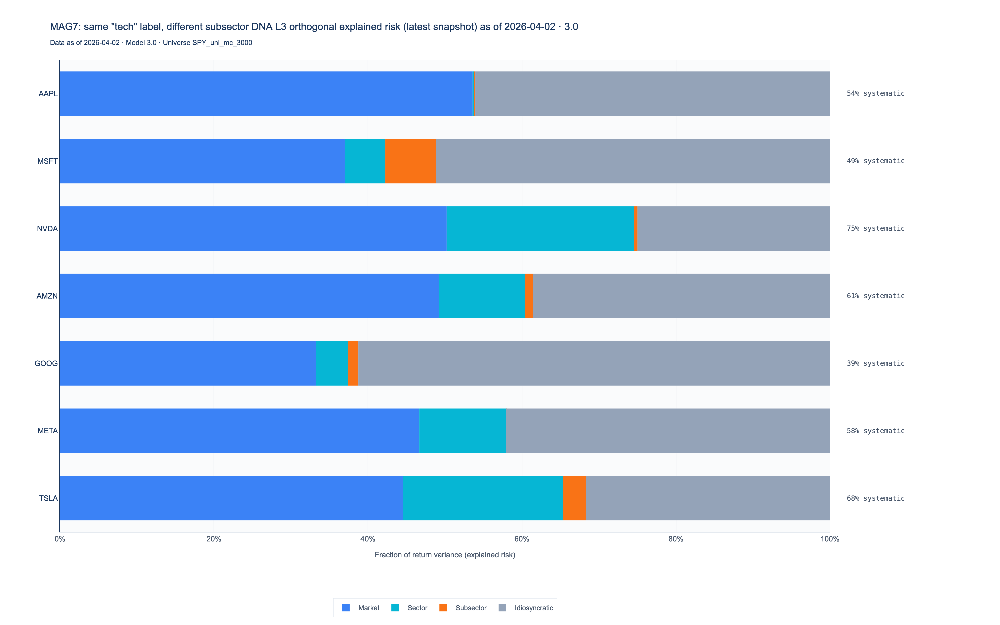

# riskmodels-py

[](https://pypi.org/project/riskmodels-py/)

Published on PyPI as [`riskmodels-py`](https://pypi.org/project/riskmodels-py/) (import package `riskmodels`).

Python SDK for the [RiskModels API](https://riskmodels.app) (ERM3 factor model: hedge ratios, explained risk, batch portfolio analysis).

## Install

```bash
pip install riskmodels-py
# Optional xarray panel interface:
pip install riskmodels-py[xarray]
# Optional Plotly/Matplotlib charts (L3 decomposition, portfolio cascades):
pip install riskmodels-py[viz]
```

From this monorepo:

```bash
cd sdk && pip install -e ".[dev]"
```

Requires **Python 3.10+**.

### Local env files (monorepo / Next.js parity)

Put your API key in **`.env.local`** (recommended) or `.env`:

- **Monorepo:** `RISKMODELS_API_KEY=rm_agent_...` in the **repository root** `.env.local` (same file the Next.js app uses), and/or in **`sdk/.env.local`** if you only work under `sdk/`. Shell `export` values always win over files.

With `pip install -e ".[dev]"` or `pip install "riskmodels-py[dotenv]"`, `RiskModelsClient.from_env()` loads **`.env`** then **`.env.local`** by walking up from the current working directory to the first folder that contains either file. **Existing environment variables are never overwritten** (shell exports and CI secrets win). Among files only, `.env.local` overrides `.env` for keys not already set.

**Readme asset script:** [`scripts/generate_readme_assets.py`](../../scripts/generate_readme_assets.py) (run from repo root) also loads `.env` / `.env.local` from the **repo root** and from **`sdk/`**, so a key stored only in `sdk/.env.local` is picked up.

To call a **local** Next app (`npm run dev`), set **`RISKMODELS_BASE_URL=http://localhost:3000/api`** in `.env.local` (see repo root `MAINTENANCE_GUIDE.md`).

## Quickstart

```python
from riskmodels import RiskModelsClient

client = RiskModelsClient.from_env()  # RISKMODELS_API_KEY or OAuth client env vars; optional .env / .env.local (see below)
df = client.get_metrics("NVDA", as_dataframe=True)
pa = client.analyze({"NVDA": 0.5, "AAPL": 0.5})  # alias for analyze_portfolio
print(pa.portfolio_hedge_ratios["l3_market_hr"])
print(pa.to_llm_context())
```

### Namespaces + charts (v0.3+)

With **`pip install riskmodels-py[viz]`**:

```python
from riskmodels import RiskModelsClient

client = RiskModelsClient.from_env()

# Single- or multi-name L3 risk (σ-scaled horizontal bars)
fig = client.stock.current.plot(
    style="l3_decomposition",
    sigma_scaled=True,
    tickers=["AAPL", "MSFT", "NVDA", "AMZN", "GOOG", "META", "TSLA"],
)
fig.show()
```

**MAG7 — L3 explained risk (variance shares to 100%)** — same chart as `RM_ORG/demos/article_visuals.py` “risk DNA” variant (1): horizontal stacked bars, x-axis is **fraction of variance**, right-rail annotations use **ER / systematic %** (not σ-scaled). The SDK Plotly figure defaults to **`theme="light"`** to match the article / matplotlib reference (white plot area, vertical x-grid, left y-spine, airy bar spacing). Pass **`theme="terminal_dark"`** to `plot_l3_horizontal` / `save_l3_decomposition_png` for a dark canvas. Use **`GOOG`** as the canonical Alphabet symbol.



```python
from riskmodels import RiskModelsClient, plot_mag7_l3_explained_risk, save_mag7_l3_explained_risk_png

client = RiskModelsClient.from_env()
fig = plot_mag7_l3_explained_risk(client)  # or pass tickers=[...]
fig.show()

save_mag7_l3_explained_risk_png(client, filename="mag7_l3_explained_risk.png")
# client.visuals.save_mag7_l3_explained_risk_png(filename="mag7_l3_explained_risk.png")
```

**MAG7 portfolio risk cascade (weights ∝ market cap)** — fetch the MAG7 list, pull **`market_cap`** from each `get_metrics` snapshot, normalize to weights, then plot a variable-width stacked L3 decomposition (bars touch; width ∝ weight):

```python
import pandas as pd
from riskmodels import RiskModelsClient

client = RiskModelsClient.from_env()

mag7 = client.search_tickers(mag7=True)
caps: list[tuple[str, float]] = []
for sym in mag7["ticker"].astype(str).str.upper():
    snap = client.get_metrics(sym, as_dataframe=True)
    row = snap.iloc[0]
    cap = row.get("market_cap")
    if cap is None or (isinstance(cap, float) and pd.isna(cap)):
        continue
    caps.append((sym, float(cap)))

weights = pd.DataFrame(caps, columns=["ticker", "market_cap"])
weights["weight"] = weights["market_cap"] / weights["market_cap"].sum()
positions = weights[["ticker", "weight"]].to_dict("records")

fig = client.portfolio.current.plot(
    positions=positions,
    style="risk_cascade",
    sort_by="weight",
    include_systematic_labels=True,
)
fig.show()

# Optional: bundled PDF snapshot (premium endpoint; same weights)
# pdf_bytes = client.portfolio.current.pdf(positions=positions)
```

**Portfolio risk snapshot PDF** (`POST /portfolio/risk-snapshot`) — raw bytes without the visuals namespace:

```python
from pathlib import Path
from riskmodels import RiskModelsClient

client = RiskModelsClient.from_env()
pdf_bytes, _lineage = client.post_portfolio_risk_snapshot_pdf(
    [("NVDA", 0.3), ("AAPL", 0.25), ("MSFT", 0.25), ("GOOGL", 0.2)],
    title="My sleeve",
)
Path("snapshot.pdf").write_bytes(pdf_bytes)
```

Stdlib-only example from repo root: `python examples/python/portfolio_risk_snapshot_pdf.py` (see `docs/portfolio-risk-snapshot-runbook.md`).

### Publication PNGs (Kaleido)

With `pip install riskmodels-py[viz]` (Plotly + Kaleido), you can save finished charts in one or two lines. Defaults target **~1600×1000** logical pixels with **scale=3** for crisp PNGs; optional **`dpi`** maps to Kaleido scale as **`dpi / 96`** (96 dpi baseline). Optional **`figsize=(width_px, height_px)`** overrides **`width`** / **`height`**.

```python
from riskmodels import RiskModelsClient, save_l3_decomposition_png, save_mag7_l3_explained_risk_png, save_portfolio_risk_cascade_png
from riskmodels.visuals import mag7_cap_weighted_positions

client = RiskModelsClient.from_env()

save_mag7_l3_explained_risk_png(client, filename="mag7_l3_explained_risk.png")

save_l3_decomposition_png(
    client,
    ticker="NVDA",
    filename="nvda_l3.png",
    title="NVDA — L3 risk decomposition",
    width=1600,
    height=1000,
    scale=3,
)

positions, weight_source = mag7_cap_weighted_positions(client)
save_portfolio_risk_cascade_png(
    client,
    positions=positions,
    filename="mag7_risk_cascade.png",
    subtitle=f"weights: {weight_source}",
)

# Equivalent facades on the client:
# client.visuals.save_l3_decomposition_png(filename="nvda_l3.png", ticker="NVDA")
# client.visuals.save_portfolio_risk_cascade_png(positions=positions, filename="mag7_risk_cascade.png")

# Optional: write NVDA + MAG7 L3 ER + MAG7 risk + MAG7 attribution PNGs to a folder (gallery helpers)
# from riskmodels.visuals import run_gallery_all
# run_gallery_all(client, output_dir="figures")
```

**CLI (monorepo):** from the repo root, with a key in `.env.local` or the environment:

```bash
python scripts/run_visuals_gallery.py -o figures
# Regenerate the readme figure into sdk/images/:
# python scripts/run_visuals_gallery.py -o sdk/images --charts mag7-l3-er
```

Use `--charts nvda` / `mag7-l3-er` / `mag7-risk` / `mag7-attribution` for a single chart.

`mag7_cap_weighted_positions` uses **`market_cap`** from each `get_metrics` snapshot when enough values exist; otherwise it falls back to documented illustrative **early 2026** cap-share weights (see `MAG7_SNAPSHOT_DATE_DOC` in `riskmodels.visuals.gallery`). `save_portfolio_attribution_cascade_png` needs the batch **returns** panel (the helper requests it automatically).

Weights are **holdings-style fractions** (sum to 1); `analyze_portfolio` renormalizes if a ticker fails batch resolution. Ticker aliases (e.g. GOOGL→GOOG) follow the usual `ValidationWarning` path.

**Readable metrics snapshot (CLI):** after `pip install -e ".[dev]"` from `sdk/`, run:

```bash
export RISKMODELS_API_KEY=...
python examples/quickstart.py
```

Optional: `RISKMODELS_QUICKSTART_TICKER=AAPL`. The script prints L3 hedge ratios, explained risk, optional market fields, and the ERM3 legend. Use `format_metrics_snapshot(row)` in your own code for the same text layout from a `get_metrics` dict row.

### Metrics + macro factor correlation (one row)

ERM3 snapshot plus `macro_corr_*` columns (Pearson/Spearman vs bitcoin, VIX, etc.). `macro_corr_*` values are **return correlations**, not dollar hedges (`l3_market_hr`) or variance shares (`l3_residual_er`). Use `return_type="gross"` for total-equity co-movement with macro; use `"l3_residual"` for the idiosyncratic sleeve vs macro.

```python
from riskmodels import RiskModelsClient, to_llm_context

client = RiskModelsClient.from_env()
snap = client.get_metrics_with_macro_correlation(
    "NVDA",
    factors=["bitcoin", "vix"],
    return_type="l3_residual",
    window_days=252,
)
print(snap["macro_corr_bitcoin"].iloc[0], snap["l3_market_hr"].iloc[0])
print(to_llm_context(snap))
```

### Raw macro factor series (no ticker)

`get_macro_factor_series()` calls **`GET /macro-factors`** — long table of `factor_key`, `teo`, `return_gross` for charts or offline checks. Requires the **`macro-factor-series`** scope on your API key (included in the SDK default scope string).

## README and docs site PNGs (maintainers)

From the **repository root** (not `sdk/`), with a free-tier `RISKMODELS_API_KEY`:

```bash
export RISKMODELS_API_KEY='paste-your-key-here'
python scripts/generate_readme_assets.py
```

Use single quotes around the key. If you add an end-of-line comment, it must start with `#` (ASCII). Otherwise put the comment on its own line above.

This calls **MAG7** `POST /correlation` and `get_rankings`, then writes `assets/*.png` and mirrors the same files to `public/docs/readme/` for the Next.js docs hub. Commit both trees so GitHub and the portal stay in sync.

## Recursive Visual Refinement (MatPlotAgent)

Generate professional financial visualizations through automated Vision-LLM feedback:

```python
from openai import OpenAI
from riskmodels import RiskModelsClient

client = RiskModelsClient.from_env()
llm = OpenAI(api_key="...")

result = client.generate_refined_plot(
    plot_description="L3 risk decomposition stacked area chart for NVDA over 2 years",
    output_path="nvda_risk.png",
    llm_client=llm,
    max_iterations=5,
)

print(f"Generated in {result.iterations} iterations")
print(f"Saved to: {result.output_path}")
```

The `generate_refined_plot` method implements the **MatPlotAgent Pattern**:
1. **Execute**: Runs generated matplotlib code in a subprocess
2. **Capture**: Collects execution errors or output PNG
3. **See**: Sends the image to a Vision-LLM (GPT-4o or Claude 3.5 Sonnet)
4. **Evaluate**: LLM audits for overlapping text, legibility, legend accuracy, styling
5. **Refine**: Iterates until "COMPLETE" or max iterations reached

**Requirements**: `pip install openai matplotlib` (or `anthropic`)

**Financial Color Standards** (enforced automatically):
- Market Risk (SPY): **Indigo** (#4B0082)
- Sector Risk: **Green** (#228B22)  
- Residual/Idiosyncratic: **Gray** (#808080)

Environment variables:

- `RISKMODELS_API_KEY` — static Bearer token, or
- `RISKMODELS_CLIENT_ID` + `RISKMODELS_CLIENT_SECRET` — OAuth2 client credentials (JWT ~15m),
- `RISKMODELS_BASE_URL` (default `https://riskmodels.app/api`),
- `RISKMODELS_OAUTH_SCOPE` (optional).

## Agent-native helpers (vibe coding)

Use these so agents and humans **never guess wire names or ERM3 semantics**:

| Tool | Purpose |
|------|---------|
| **`client.discover()`** | Markdown or **JSON** digest (`format="json"`, `to_stdout=False`): each method includes **`description`**, **`parameters`** (name, type, required, defaults, enums), **`returns`**, plus **`tool_definition_hints`** for Claude Desktop / MCP-style tool synthesis. |
| **Ticker alias** | Curated remap (e.g. GOOGL→GOOG) logs `info` and emits **`ValidationWarning`** (`Warning:` … `Fix:`) so agents refresh symbols. |
| **`to_llm_context(obj)`** | One call → Markdown tables + lineage + **semantic cheatsheet** + ERM3 legend (`obj` = `DataFrame`, `PortfolioAnalysis`, `xarray.Dataset`, or `dict`). |
| **`df.attrs["legend"]`** | Short ERM3 text on **every** tabular result from the client (same as `SHORT_ERM3_LEGEND`). |
| **`df.attrs["riskmodels_semantic_cheatsheet"]`** | Wire→semantic map + column hints + units (JSON + bullet list). Ground truth for field names. |
| **`df.attrs["riskmodels_lineage"]`** | JSON string: model version, as-of, factor set, universe size when the API sent them. |
| **`df.attrs["riskmodels_kind"]`** | What produced the frame (`ticker_returns`, `portfolio_per_ticker`, `tickers_universe`, …). |
| **`validate="warn"` \| `"error"` \| `"off"`** | ER sum + HR sign checks; **`Error:` / `Warning:` … `Fix:`** strings for self-correction. |
| **`attach_sdk_metadata` / `ensure_dataframe_legend`** | If you build a `DataFrame` manually, attach the same attrs so `to_llm_context` stays consistent. |
| **`build_semantic_cheatsheet_md()`** | Standalone cheatsheet string for custom prompts. |

**Semantic names (always use in code and LLM explanations):** `l3_market_hr`, `l3_sector_hr`, `l3_subsector_hr`, `l3_market_er`, … — not raw V3 keys like `l3_mkt_hr`. Batch Parquet/CSV wire columns `l1`/`l2`/`l3` are renamed to those three **L3 component** HR series (not “L1/L2/L3 model levels”). Full reference (repo root):

- [`SEMANTIC_ALIASES.md`](https://github.com/BlueWaterCorp/RiskModels_API/blob/main/SEMANTIC_ALIASES.md) (same file as [`../../SEMANTIC_ALIASES.md`](../../SEMANTIC_ALIASES.md) when this README is viewed inside the monorepo)
- [`docs/ERM3_ZARR_API_PARITY.md`](https://github.com/BlueWaterCorp/RiskModels_API/blob/main/docs/ERM3_ZARR_API_PARITY.md)

**Tip for agents:** Prefer `get_metrics(..., as_dataframe=True)` so you get attrs; the plain `dict` return has no `attrs`.

**Cursor:** [`.cursorrules`](https://github.com/BlueWaterCorp/RiskModels_API/blob/main/.cursorrules) (math, naming, batch semantics).

## PyPI distribution name vs import

- **Install from PyPI:** `pip install riskmodels-py` (and optionally `pip install riskmodels-py[xarray]`).
- **Import in Python:** `from riskmodels import …` — the **distribution** on PyPI is `riskmodels-py`; the **package** directory is `riskmodels`.

Core runtime dependencies are **pandas**, **pyarrow**, and **httpx** (HTTP). **xarray** is optional (`[xarray]` extra). The SDK does not depend on `requests`.

## PyPI releases (maintainers)

Upload steps (version bump, `build`, `twine`, PyPI token format) are **not** in this public README. They are maintained in the private **BWMACRO** monorepo at **`docs/RISKMODELS_PY_PYPI_PUBLISHING.md`** — open that file from your internal BWMACRO clone.

## Contributors

Named SDK contributors are listed in **`riskmodels/contributors.py`** and appear automatically in **`client.discover()`** (Markdown body and JSON spec key **`contributors`**), so anyone loading the capability digest — including coding agents — sees public credit.

## License

Proprietary — same terms as RiskModels API access.
