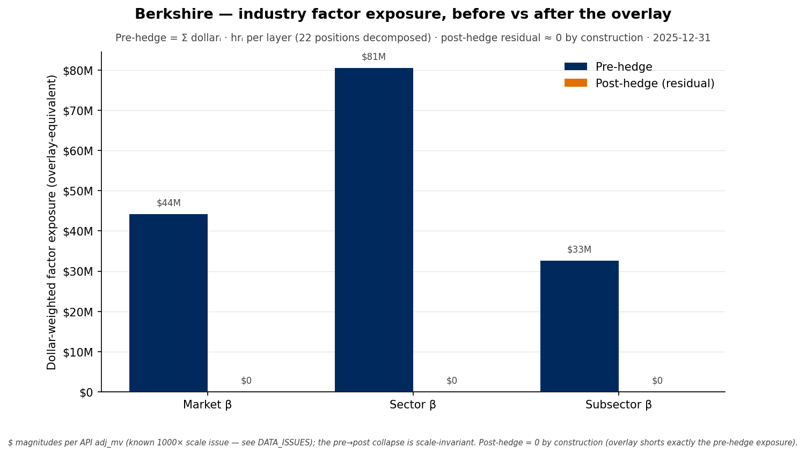

# Berkshire — industry factor exposure, before vs after the overlay

**What it shows.** Berkshire's dollar-weighted exposure to each industry factor layer
— market, sector, subsector — before the overlay (navy) and the residual after it
(orange). Pre-hedge exposures are large and clearly non-zero (**$44M market, $81M
sector, $33M subsector** in overlay-equivalent dollars); post-hedge they collapse to
~$0. Sector is the biggest exposure, consistent with Berkshire's financials tilt.

**How it was computed.** Each position is decomposed on the industry axis; pre-hedge
exposure per layer = Σᵢ (dollarᵢ · hrᵢ,layer) across the 22 decomposed positions. The
overlay is defined to short exactly that per-layer amount, so post-hedge residual = 0
**by construction** — this chart visualizes what the overlay removes, not an
independent measurement. (The empirical, independently-measured version of "did it
work" is the raw-vs-hedged realized-beta chart, which shows β 0.66 → 0.08.)

**Scale caveat.** Dollar magnitudes reflect the API's current-period `adj_mv` (~1000×
scale issue, see DATA_ISSUES.md); the pre→post collapse is scale-invariant.
