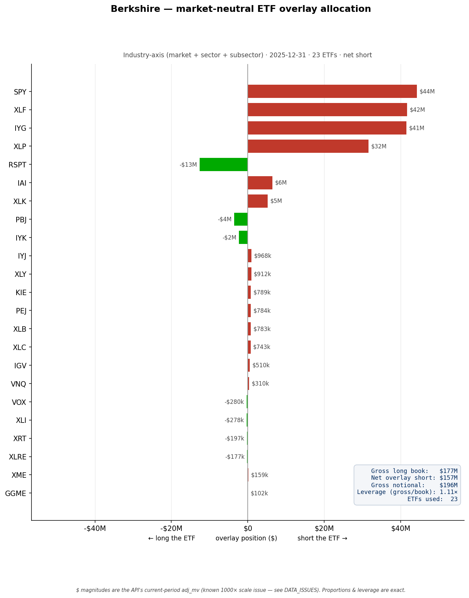

# Berkshire — market-neutral ETF overlay allocation

**What it shows.** The ETF overlay that neutralizes Berkshire's disclosed long
book on the industry axis (market + sector + subsector), one bar per ETF. Shorts
extend right (red), long-ETF legs extend left (green), sorted by absolute size.
SPY, XLF and IYG dominate — Berkshire's book is heavy financials (AXP, V, MA, MCO,
COF) and consumer staples (KO, KR), so the overlay shorts exactly those exposures;
RSPT is bought back (long) to offset a net-negative tech-subsector loading.

**Summary (from the box).** 23 ETFs, net short **$157M**, gross overlay notional
**$196M**, **1.11× gross notional leverage** over the long book.

**How it was computed.** Each disclosed position is decomposed (`client.decompose`)
on the industry axis; the per-dollar hedge ratios are dollar-weighted and netted by
ETF via `n_leg_hedge` (positive = short, negative = long). Style is measurement-only
and excluded by design.

**Scale caveat.** Dollar magnitudes reflect the API's current-period `adj_mv`, which
carries a known ~1000× scale inconsistency (see DATA_ISSUES.md) — read Berkshire's
book as ~$176B, not $176M. Proportions, the ETF mix, and the 1.11× leverage are
scale-invariant and exact.
