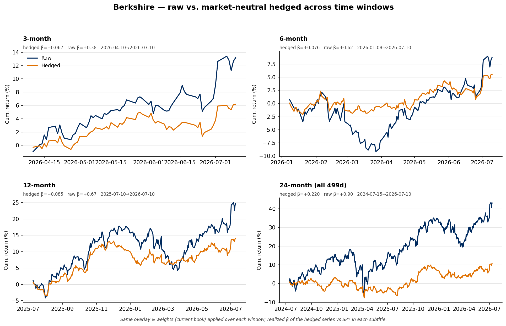

# Berkshire — raw vs hedged across time windows

**What it shows.** The raw long book (navy) vs the market-neutral hedged series
(orange) over four trailing windows — 3, 6, 12 and 24 months — using the *same*
current overlay and weights. Purpose: confirm the beta reduction isn't an artifact
of one 12-month sample. Each subtitle reports the hedged series' realized β vs SPY.

**Realized β vs SPY holds across horizons:**

| Window | Raw β | Hedged β | Reduction |
|---|---:|---:|---:|
| 3-month | +0.38 | +0.067 | 82% |
| 6-month | +0.62 | +0.076 | 88% |
| 12-month | +0.67 | +0.085 | 87% |
| 24-month | +0.90 | +0.220 | 76% |

The hedge cuts market beta by 76–88% in every window. The 24-month residual β (0.22)
is higher than the shorter windows because the overlay is built on the **current**
book and factor loadings, then applied backward — two years ago Berkshire's
composition and betas differed, so today's overlay is a looser fit to older returns.
That's expected, and it argues for a point-in-time overlay (rebuilt per vintage) for
long backtests — a natural next build.

**How it was computed.** raw = Σ wᵢ·rᵢ over disclosed weights; hedged = raw −
Σ(shortⱼ/gross_long)·r_etfⱼ. Daily gross returns from `get_ticker_returns` (2y pulled
once, 499 trading days 2024-07-15→2026-07-10, no missing symbols), sliced per window;
β = cov(hedged, SPY)/var(SPY). Overlay reused from the cached decomposition.
