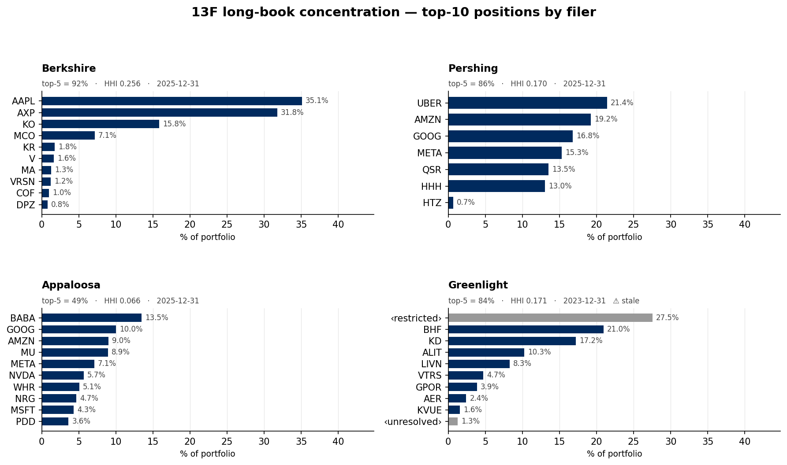

# Concentration comparison — top-10 positions by filer

**What it shows.** The disclosed 13F long book of four managers, each as its
top-10 positions by portfolio weight (largest at top), on a shared 0–45% x-axis so
the books are directly comparable. Panel subtitles carry the top-5 weight sum, the
Herfindahl-Hirschman index (HHI), and the report date.

**The spread is the story.** Concentration ranges widely:

| Filer | top-5 | HHI | Report | Note |
|---|---:|---:|---|---|
| Berkshire | 92% | 0.256 | 2025-12-31 | AAPL 35% + AXP 32% dominate |
| Pershing | 86% | 0.170 | 2025-12-31 | 7-name book, all ≥13% except HTZ |
| Greenlight | 84% | 0.171 | 2023-12-31 | ⚠ stale; top "position" is confidential |
| Appaloosa | 49% | 0.066 | 2025-12-31 | most diversified, 25 names |

**How it was computed.** For each filer, `PortfolioTimeSeries.from_cik(...).as_of(today)`
pulls the current disclosed snapshot; weights are the 13F-disclosed position weights.
HHI = Σ wᵢ² and top-5 are read from `get_filer_concentration` (cross-checked against
the hand-computed values). Greenlight's largest bar and Appaloosa/others' grey bars
are **confidential-treatment (`BW-RESTRICTED`)** or unresolved-FIGI rows — labelled
`‹restricted›` / `‹unresolved›` and greyed, never silently dropped.

**Caveats.** Greenlight's latest available filing is 2023-12-31 (stale vs the others'
2025-12-31), and 27.5% of its book is a single confidential position — both limit how
much weight to put on its concentration read. See DATA_ISSUES.md.
