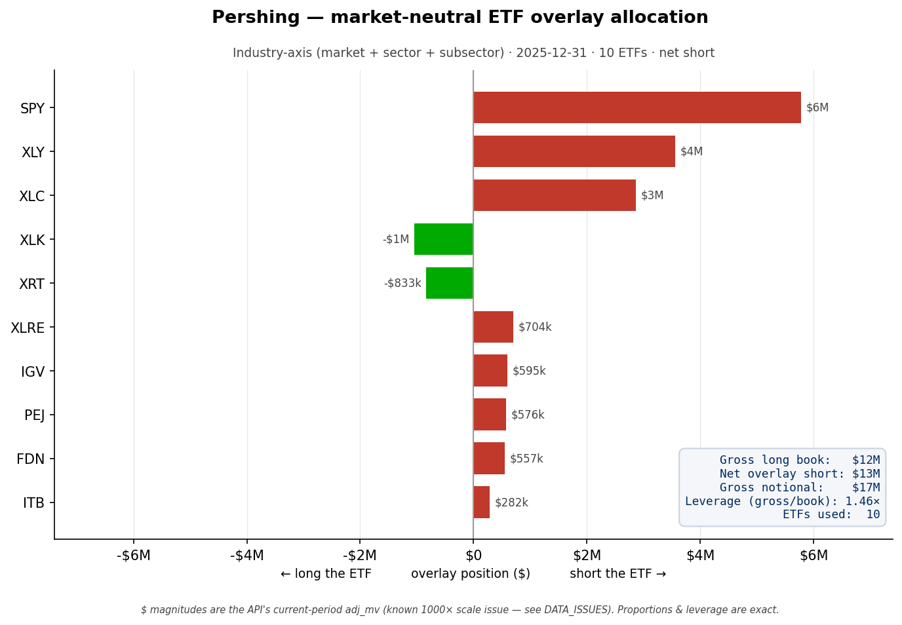

# Pershing — market-neutral ETF overlay allocation

**What it shows.** The industry-axis ETF overlay that neutralizes Pershing Square's
7-name long book. Shorts extend right (red), long-ETF legs left (green), sorted by
absolute size. SPY, XLY and XLC lead — the book tilts to consumer-discretionary and
communications (Uber, Amazon, Alphabet, Meta, QSR, Howard Hughes).

**Summary (from the box).** 10 ETFs, net short **$13M**, **1.46× gross notional
leverage** — more levered than Berkshire's 1.11×, because a concentrated 7-name book
compounds sector/subsector betas that don't diversify away.

**How it was computed.** Same pipeline as Berkshire: per-position `decompose` on the
industry axis, dollar-weighted hedge ratios netted by ETF via `n_leg_hedge`.

**Scale caveat.** Dollar magnitudes reflect the API's current-period `adj_mv` (~1000×
scale issue, see DATA_ISSUES.md) — read the book as ~$11.5B. Proportions and the 1.46×
leverage are exact.
